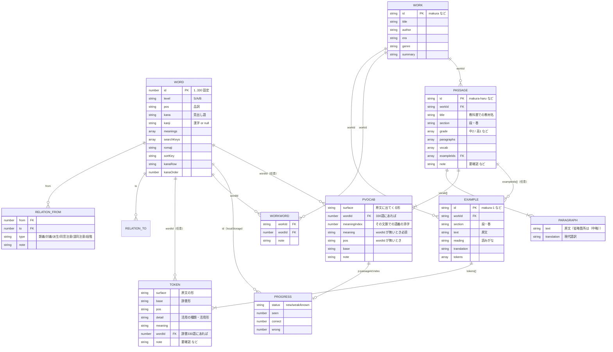
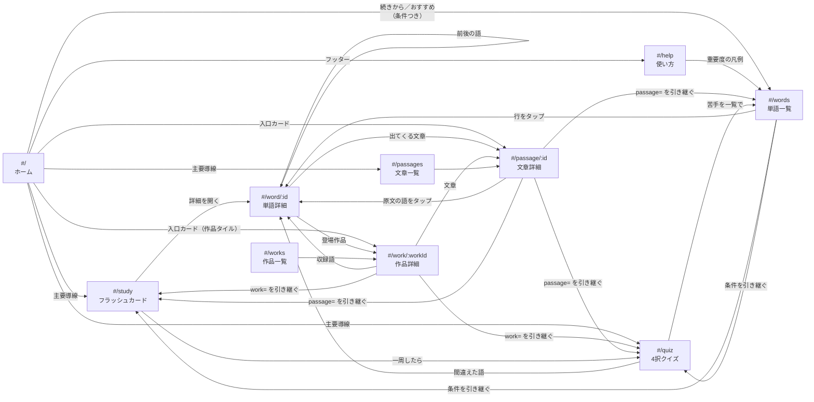

# 古文単語帳アプリ 設計書

プロトタイプ。**「あとから要素を足していける」ことを最優先**にしたデータ設計になっている。
この文書は、いま何がどう繋がっているかと、足したくなったときにどこを触るかを書いたもの。

---

## 1. 基本方針

| 決めごと | 理由 |
|---|---|
| ビルド不要の静的アプリ | `index.html` をダブルクリックすれば動く。環境構築でつまずかない |
| データは `data/*.js`（JSON ではない） | `file://` では `fetch` が CORS で弾かれる。`window.KOBUN.words = [...]` の形なら `<script>` で普通に読める |
| ES モジュールを使わない | `type="module"` も `file://` では CORS で弾かれる。素の `<script>` を順番に並べる |
| Vanilla JS / 依存ゼロ | npm も CDN も要らない。5 年後に開いても動く |
| ハッシュルーティング | `#/word/39` で直リンクできて、かつ `file://` でも動く |
| 学習履歴のキーは `id` | `kana` は重複しうる（`ながむ`〔眺む〕/〔詠む〕、`ゐる`〔居る〕/〔率る〕） |
| 教材の文章は `data/passages.js` に別置き | 例文（文単位・全トークン品詞分解）と、教材（数段落・訳つき）は量も用途も違う。混ぜると examples.js が肥大する |
| UTF-8（BOM なし）／`.bat` を作らない | Windows の cp932 で日本語入り `.bat` が壊れる問題を避ける。起動用は `start.ps1` |

---

## 2. データモデル



### ファイルと責務

| ファイル | 中身 | 素材との関係 |
|---|---|---|
| `data/words.js` | 単語 330 語 | 素材 `kobun_words.json` を **無変更** で移し替え |
| `data/works.js` | 作品 6 件 | 新規（アプリ側の追加データ） |
| `data/relations.js` | 単語間リンク 57 本 | 新規 |
| `data/examples.js` | 例文 10 文＋品詞分解 308 トークン | 新規 |
| `data/workWords.js` | 作品タグ 26 件 | 新規 |
| `data/passages.js` | 教材 20 編（段落 65・vocab 250 件） | 新規 |

`words.js` を素材そのままに保つことで、**素材が更新されたら再生成して差し替えるだけ**で済む。
アプリ独自の情報は必ず別ファイルに置き、`id` で紐づける。

### 設計の要点

**1. 例文はトークン列で持つ**

例文を「原文の文字列＋現代語訳」だけで持つと、単語と例文を結ぶのに文字列検索が必要になり、
活用形（`うつくしう` ≠ `うつくし`）と同音異義語（`ながむ` が 2 語）で必ず破綻する。
トークン単位で `wordId` を持たせれば、リンクは id で確定する。
`tokens` はそのまま品詞分解の表示データにもなり、原文タップのポップアップにも使える。

**2. 関連語は片方向で書く**

`{ from: 39, to: 41, type: '対義' }` と 1 行書けば、`js/data-index.js` が
`をかし → あはれなり` と `あはれなり → をかし` の両方に展開する。
逆向きの行を書く必要がない＝データの重複がないので、直すときも 1 か所で済む。

**3. 作品の収録語は「和集合」**

作品ページの収録語 ＝ **例文 tokens の wordId** ∪ **workWords の手動タグ**
∪ **passages の vocab の wordId**。
例文や文章を書けば自動的に語が紐づき、まだ無い語も手で足せる。
あとから重複しても、和集合なので二重に出ない。

**3-b. 教材（文章）は品詞分解しない**

`examples.js` は 1 文を全トークンに割るので、10 文で 308 トークンある。
教材 20 編（65 段落）を同じ密度で持つと数千トークンになり、書くのも直すのも現実的でない。
そこで `passages.js` は **原文と訳を段落単位で持ち、覚える語だけを `vocab` に列挙**する。
原文中のハイライトは `vocab[].surface` の **文字列一致**で行う（`js/components.js` の `passageLine`）。

文字列一致で困るのは 2 点だけで、どちらも対処済み:

- **包含関係**（`たまへ` ⊂ `のたまへ`）… surface を **長い順**に試すので長いほうが勝つ。
- **別語の一部に当たる**（`え` が `消え` に当たる）… 1 文字の仮名 surface を
  `tools/validate.mjs` が警告する。`え得` `え張る` のように 2 文字以上の形で書く。

同じ surface が本文に何度出てきても、走査位置を進めるだけなので全部ハイライトされる。

**3-c. 文章固有語は「330 語と同じ形」に包む**

教科書の脚注に出るような語（`かいもちひ` `ずちなく`）は 330 語に無い。
これを学習カード・クイズに出すために、`js/data-index.js` が Word と同じ形の
オブジェクト（`isPassageWord: true`、level は `'P'`）に包む。
包んでしまえば **`view-study.js` / `view-quiz.js` はそのまま動く**。
違いは id が数値でなく `"p:<passageId>:<index>"` という文字列であることだけで、
そこは `store` が文字列キーを受け付けるようにしてある。

**4. 検索キーは素材の正規化ルールに乗る**

`searchKeys` は「濁点を清音化・小書き仮名を大書きに・記号を除去・ゐゑを→いえお」で
作られている（SCHEMA.md）。`js/util.js` の `normalizeKana()` がクエリに同じ変換をかけるので、
`つれづれ` でも `つれつれ` でも当たる。
ローマ字は「仮名の字面」寄り（`たまふ` → `tamafu`、`をかし` → `okashi`）なので、
`romajiVariants()` で `wokashi` → `okashi`、`hu` → `fu` の揺れも吸収している
（330 語の romaji に `wo/wi/we/hu` が出現しないことは `tools/validate.mjs` が確認する）。

---

## 3. 画面と遷移



### ルート一覧

| パス | ビュー | クエリ |
|---|---|---|
| `#/` | `view-home` | —（ハッシュ無しで開いたときもここ） |
| `#/help` | `view-help` | `?to=` 節へスクロール（about / level / search / plan / cards / passage / history / data / env） |
| `#/words` | `view-words` | `?q= &level= &pos= &row= &work= &passage= &status= &sort=` |
| `#/word/:id` | `view-word` | — |
| `#/works` | `view-works` | — |
| `#/work/:workId` | `view-works`（詳細） | — |
| `#/passages` | `view-passages` | `?grade=` |
| `#/passage/:id` | `view-passages`（詳細） | — |
| `#/study` | `view-study` | 単語一覧と同じ（`sort` 以外） |
| `#/quiz` | `view-quiz` | 同上 |

ホームと使い方はナビの扱いが他と違う。
**ホームはヘッダ左のタイトル**から、**使い方はヘッダ右の小さなリンク**から開く。
スマホの下タブ（`position: fixed`）は 5 個のままにしたいので、この 2 つをタブに足さない。
どちらも全幅で常に見えるうえ、フッターにもリンクがある。

### フィルタ条件は URL に持つ

`#/words?q=&level=S&pos=敬語&row=あ行&work=makura&passage=makura-haru&status=weak&sort=kana`

- ブックマークできる／共有できる
- 学習・クイズへ **同じクエリのまま** 渡せる（`#/study?level=S&pos=敬語`）
- 絞り込みロジックは `js/components.js` の `applyFilters()` 1 か所だけ。3 画面で共有している

`passage=` だけ扱いが少し違う。ほかの条件が「330 語を絞る」のに対し、
`passage=` は **母集団そのものを差し替える**（330 語 → その文章の語＋文章固有語）。
この分岐は `js/components.js` の `deckSource()` 1 か所にまとめてあり、
単語一覧・学習・クイズの 3 画面はどれも `applyFilters(deckSource(query), query)` と書く。
`passage=` があるときは `work=` は無視する（意味が重なるため）。

### 各画面

| 画面 | できること |
|---|---|
| **ホーム** | アプリの説明と 3 つの主要導線（学習／文章／クイズ）。330 語の進捗（覚えた・苦手・未学習）と「続きから」（最後に学習したデッキ・最後に読んだ文章）。履歴ゼロなら「まず S ランク 114 語から」。おすすめ（苦手が溜まっていれば復習、なければ未学習の行）。重要度・品詞・作品・学年・文章への入口カード |
| **使い方** | できること／重要度 S・A・B の意味／検索のコツ／学習の進め方／カードとクイズの操作／文章ページの見方／**学習履歴はこのブラウザだけに保存されること**とリセット（2 段階ボタン）／データの出どころ／動作環境。`?to=history` のように節を指定して開ける |
| **単語一覧** | かな／ローマ字／漢字／意味で検索。重要度・品詞・五十音行・作品・学習状態でフィルタ。五十音順／重要度順／品詞順でソート。各行に学習状態バッジ |
| **単語詳細** | 語義一覧、学習状態の切り替え、関連語カード（type ごとにグループ化）、この語を含む例文（該当トークンをハイライト、タップで品詞分解ポップアップ、`wordId` があればその語へ飛べる）、品詞分解の一覧表、登場作品、五十音順の前後ナビ |
| **作品一覧／詳細** | 作品の書誌と紹介。作品ごとの文章・例文・収録語（「例文」／「文章」／「タグ」バッジで由来がわかる）。「この作品の単語で学習／クイズ」 |
| **文章一覧** | 教材を作品別にグループ化。学年でしぼれる。各文章の段落数・語数・学習進捗（覚えた/総数）を表示 |
| **文章詳細** | 原文と現代語訳を段落ごとに対応表示（上下／横並びの切替、訳の表示・非表示）。原文の重要語をタップで語義ポップアップ。この文章の単語一覧（330 語は詳細へリンク、文章固有語はその場で語義）。「この文章の単語で学習／クイズ」。品詞分解つき例文があれば併せて表示 |
| **学習** | フィルタしたデッキをカードで。表＝見出し語 → めくると語義＋例文。「覚えた／まだ」を記録。Space でめくる、←→ で回答。一周後に「まだの語だけで復習」 |
| **クイズ** | 4択。誤答は **同じ品詞の別語** から取る（SCHEMA.md の推奨）。語→意味／意味→語 の 2 形式。1〜4 の数字キーで回答。結果を localStorage に記録し、間違えた語だけ再出題できる |

---

## 4. コードの構成

```
index.html          <script> を順番に並べるだけ。順序に意味がある
css/style.css       CSS 変数で配色を一括管理。ダークモードは prefers-color-scheme
data/*.js           データ（人が編集する）
js/util.js          DOM の小道具・文字列正規化・検索スコア
js/store.js         localStorage（学習履歴・設定・クイズ履歴）
js/data-index.js    data/*.js から索引をつくる ★ここが接着剤
js/components.js    画面をまたぐ部品（単語行・関連語カード・例文カード・フィルタ・ポップアップ）
js/router.js        ハッシュルーター
js/view-home.js     ホーム（既定ルート #/。index と store しか読まない）
js/view-help.js     使い方（説明文はこのファイルの中。数字は index から出す）
js/view-words.js    単語一覧
js/view-word.js     単語詳細
js/view-works.js    作品一覧＋作品詳細
js/view-passages.js 文章一覧＋文章詳細
js/view-study.js    フラッシュカード
js/view-quiz.js     クイズ
js/app.js           起動
tools/validate.mjs  データ整合性チェック（Node）
```

依存の向きは一方向：`data → data-index → components → view-* → app`。
ビューはデータ形式を直接知らず、`KOBUN.index` のメソッド越しに引く。
そのため **データの持ち方を変えても `data-index.js` だけ直せば済む**。

---

## 4-b. UI 方針とデザイントークン

### 方針

| 決めごと | 理由 |
|---|---|
| **明朝は「古語」だけ** | 見出し語・原文・作品名・画面タイトルは `--font-serif`。UI（ボタン・バッジ・訳・説明文）はゴシック。字面で「これは古文だ／これは操作だ」が分かる |
| **重要度 S/A/B の色は全画面で同じ** | 一覧の左端の色帯・バッジ・関連語カードで `--level-S/A/B` を共有する。色の意味を画面ごとに変えない |
| **重要度は記号だけで出さない** | `S` の 1 文字では初見で意味が分からない。バッジは必ず **「S 最重要」** の形（`C.levelBadge`）。色は S＝赤・A＝橙・B＝青緑で「重要なほど強い色」に並べ、明度も変えて色覚に依らず区別できるようにする。文章固有語は「P 文章の語」 |
| **重要度の意味は 3 か所に書く** | 単語一覧の上・ホームの入口カード・使い方ページに同じ凡例（`C.levelLegend`）を出す。説明文と語数は `KOBUN.index.levels` の 1 か所から取るので、言い方がぶれない |
| **ホームは「次の一手」だけ** | トップは入口。数字を並べるより「続きから」「苦手 N 語を復習」のようにボタン 1 つで始められる形にする。履歴ゼロのときは進捗を出さず「まず S ランクから」に置き換える |
| **語義は薄くしない** | 一覧で本当に読みたいのは語義なので `--fg` で置く。薄い色（`--fg-muted`）は補助情報だけ、`--fg-faint` は区切り記号など装飾だけ |
| **既定値はバッジにしない** | 一覧の「未学習」バッジは CSS で隠す（`.word-list .badge.status-new`）。330 行すべてに付くバッジは情報量ゼロ。要素は残すので `kobun:progress` の書き換えはそのまま動く |
| **色だけで意味を伝えない** | クイズの正誤は色＋`○`／`×`、文章の語は色＋線種（実線＝330 語／点線＝文章固有語）。文章詳細には凡例を必ず出す |
| **スマホではメニューを下タブに** | 640px 以下で `.site-nav` を `position: fixed` の下タブへ。親指の届く位置に置き、上部を本文に使う |
| **フィルタは畳める** | `C.filterBar` は `<details>` を返す。閉じていても summary に「いま効いている条件」がチップで出る。学習・クイズは既定で畳む（カードを先に見せる） |
| **コントラストは AA（4.5:1）** | `--fg-muted` は対 `--bg` 5.6:1、重要度バッジの白抜きは 5.8〜7.0:1。ダークも同様に確認済み |
| **動きは控えめ・止められる** | めくり／正誤のアニメーションは 0.2〜0.3 秒。`prefers-reduced-motion: reduce` で全部止まる |
| **外部依存ゼロは維持** | Web フォント・CDN・アイコンフォントは使わない（`file://` とオフラインで動くこと） |

### デザイントークン（`css/style.css` の `:root`）

個々のルールでは生の値を書かず、必ず `var(--…)` を使う。
色は「`:root` で明るい側を定義 → `@media (prefers-color-scheme: dark)` で暗い側だけ上書き」の一方向。

| 種類 | トークン |
|---|---|
| **面** | `--bg`（画面の地）`--bg-card`（カード）`--bg-sub`（バッジ・表頭）`--bg-inset`（カードの中の面：訳・例文） |
| **文字** | `--fg`（本文）`--fg-muted`（補助・AA 合格）`--fg-faint`（装飾のみ） |
| **罫** | `--line` / `--line-strong` |
| **強調** | `--accent` `--accent-fg` `--accent-bg` `--accent-dim`（原文の下線）`--hl`（マーカー）`--focus` |
| **状態** | `--ok`（覚えた・正解）`--danger`（苦手・不正解）`--warn`（要確認）`--on-solid`（塗りの上の文字色） |
| **重要度** | `--level-S` `--level-A` `--level-B` `--level-P`（文章固有語）`--on-level` |
| **余白** | `--sp-1`(.25rem) `--sp-2`(.5) `--sp-3`(.75) `--sp-4`(1) `--sp-5`(1.5) `--sp-6`(2) |
| **角丸** | `--r-sm`(6px) `--r-md`(10) `--r-lg`(14) `--r-pill`(999)／旧名 `--radius` |
| **影** | `--shadow-sm` / `--shadow-md` / `--shadow-lg`（旧名 `--shadow`） |
| **文字サイズ** | `--fs-xs`(.75rem) `--fs-sm`(.84) `--fs-md`(.92) `--fs-base`(1) `--fs-lg`(1.12) `--fs-xl`(1.35) `--fs-2xl`(1.7) `--fs-3xl`(2.2) |
| **行間** | `--lh-tight`(1.4 見出し) `--lh-body`(1.8 UI 本文) `--lh-read`(1.9 訳) `--lh-classic`(2.15 古文原文) |
| **書体** | `--font-ja`（ゴシック）`--font-serif`（明朝） |
| **その他** | `--maxw`(980px) `--tap`(44px 最小タップ領域) `--dur` `--ease` |

配色を変えたいときは `:root` と dark ブロックの色トークンだけを書き換える。
`--radius` `--shadow` は旧名として残してあるので、古いルールが混ざっていても壊れない。

---

## 5. 拡張ポイント（手順）

### 5.1 関連語を足すには

1. `data/words.js` を検索して、両方の語の **id** を確かめる。
   （`kana` は重複しうるので必ず id。`ながむ` は 53 と 54 の 2 語ある）
2. `data/relations.js` の配列に 1 行足す。

   ```js
   { from: 51, to: 64, type: '派生', note: 'ともに「思ふ」系。おぼゆ＝自発、おぼす＝尊敬。' },
   ```
3. **逆向きは書かない**。`data-index.js` が自動で双方向に展開する。
4. `node tools/validate.mjs` を実行してエラー 0 を確認。
5. コードの変更は不要。両方の語の詳細ページに出る。

`type` は自由に増やしてよい。表示の説明文を出したいときは
`js/view-word.js` の `TYPE_HINT` に 1 行足す。
非対称な関係（`派生` は「元 → 派生語」の向きがある）は
`js/data-index.js` の `INVERSE_TYPE` に逆向きのラベルを書く。

### 5.2 例文を足すには

1. `data/works.js` にその作品があるか確認（無ければ 5.3 を先に）。
2. `data/examples.js` に 1 件足す。`id` は `作品id-連番`。
3. `text` に原文を書き、語に割って `tokens` を作る。
   **`tokens` の `surface` を順に連結したものが `text` と一字一句同じ**になること
   （句読点も `pos: '記号'` のトークンとして入れる）。`validate.mjs` がこの一致を検査する。
4. 辞書 330 語にある語には `wordId` を付ける。付けた語の詳細ページに、この例文が自動で出る。
5. 自信のない品詞分解には `note` に「要確認」と書く。画面上で色が変わる。
6. `node tools/validate.mjs` でエラー 0 を確認。

トークンの粒度は「学校文法の単語分割」に合わせている（付属語も 1 トークン）。
複合語をどこまで割るかは揺れるので、迷ったら `note` に方針を書き残す。

### 5.2b 文章（教科書の教材）を足すには

1. `data/works.js` にその作品があるか確認（無ければ 5.3 を先に）。
2. `data/passages.js` の配列に 1 件足す。`id` は `作品id-短い名`（URL `#/passage/makura-haru`
   になるので **後から変えない**）。

   ```js
   {
     id: 'makura-haru', workId: 'makura', title: '春はあけぼの',
     section: '第一段', grade: ['中2', '高1'],
     paragraphs: [
       { text: '春はあけぼの。…', translation: '春は夜明け方（がよい）。…' }
     ],
     vocab: [
       { wordId: 39, surface: 'をかし', meaningIndex: 0 },        // 330 語にある語
       { surface: 'あけぼの', meaning: '夜明け方', pos: '名詞' }   // 文章固有語
     ],
     exampleIds: ['makura-1'],
     note: 'サンプル・要校閲'
   }
   ```
3. **原文の正確さを最優先**する。長い教材は有名な部分を抜き、
   省いた箇所は本文中に `（中略）` と書く。
   自信のない箇所は `note` に「要確認: …」と書く（画面上で橙色になる）。
4. `translation` は自分の言葉で書く（教科書・市販訳の転載はしない）。
5. `vocab` は次の 2 種類を混ぜて書く。**同じ `wordId` は 1 文章に 1 回だけ**。
   - **330 語にある語** … `wordId` と `meaningIndex`（その文脈での語義の添字）。
     活用形も見て拾う（`うつくしう` → `うつくし`、`あやしがり` → `あやし`）。
   - **文章固有語**（教科書で脚注になる語）… `meaning` と `pos` を書く。3〜10 語を目安に。
6. `surface` は **本文にそのまま出てくる文字列**にする。
   1 文字の仮名（`え`）は別語の一部に当たるので、`え得` のように 2 文字以上にする。
7. `node tools/validate.mjs` でエラー 0 を確認。
8. コードの変更は不要。文章一覧・作品詳細・単語一覧の「文章」フィルタに自動で出る。

### 5.3 新しい作品を足すには

1. `data/works.js` に 1 件足す。`id` は英小文字とハイフンだけの短い語
   （URL `#/work/genji` とデータの外部キーになるので **後から変えない**）。

   ```js
   { id: 'genji', title: '源氏物語', author: '紫式部', era: '平安時代中期',
     genre: '作り物語', summary: '…' },
   ```
2. `data/examples.js` にその作品の例文を足す（`workId: 'genji'`）。
3. 例文に出てこないが重要な語を `data/workWords.js` に足す。
4. `node tools/validate.mjs`。
5. コードの変更は不要。作品一覧・作品詳細・単語一覧の「作品」フィルタに自動で出る。

### 5.4 新しいフィールドを足すには

**単語に足す場合**（例：アクセント、語源、頻出度スコア）

- 素材との差分が分からなくなるので、`data/words.js` を直接いじらず
  **別ファイル `data/wordExtra.js`** を作って `wordId` で紐づけるのがおすすめ。

  ```js
  window.KOBUN.wordExtra = [
    { wordId: 39, etymology: '「招（を）く」と同源とする説…', accent: 'をかし＼' }
  ];
  ```
- `index.html` に `<script src="data/wordExtra.js"></script>` を追加（`js/*.js` より前）。
- `js/data-index.js` に索引を 1 つ足す（`extraByWord` の Map）。
- `js/view-word.js` に表示ブロックを足す。
- `tools/validate.mjs` に `wordId` 実在チェックを足す。

**既存オブジェクトにキーを足す場合**（例：`work.period`、`token.accent`）

- そのまま足してよい。画面側は `undefined` に耐えるように書いてある
  （`el()` は `null` の子要素を無視し、`?` で分岐している）。
- 表示したいところで 1 行足す。

**新しい「関係」の種類そのものを足す場合**（例：単語 ⇔ 文法項目）

- `data/grammar.js`（助動詞・敬語の体系など）＋ `data/wordGrammar.js`（紐づけ）を作る。
- `relations.js` / `workWords.js` と同じパターンなので、`data-index.js` の
  `wordsByWork` を作っている箇所をそのまま真似られる。

### 5.5 学習履歴の形を変えるには

保存キーは 4 つ。`kobun.v1.progress`（学習状態）／`kobun.v1.prefs`（画面設定）／
`kobun.v1.quizlog`（クイズ履歴 50 件）／`kobun.v1.recent`（ホームの「続きから」。
最後に学習したデッキの条件と、最後に開いた文章）。
`recent` は `view-study.js` と `view-passages.js` が画面を開いたときに書き、ホームだけが読む。
使い方ページの「履歴をリセット」（`store.resetAll()`）は prefs 以外の 3 つを消す。

`js/store.js` の `PREFIX = 'kobun.v1.'` を `v2` に上げ、
起動時に v1 を読んで v2 に変換する移行処理を書く。
キーが `id` である限り、単語データが更新されても履歴は生き残る。

**学習履歴のキーは 2 種類ある**（どちらも文字列で保存する）:

| キー | 何の進捗か | 例 |
|---|---|---|
| `"<数値>"` | `data/words.js` の 330 語 | `"39"`（をかし） |
| `"p:<passageId>:<vocab の添字>"` | `data/passages.js` の文章固有語 | `"p:ujishui-chigo:15"`（かいもちひ） |

330 語の進捗は単語一覧・単語詳細・文章詳細で共有される
（同じ語を別の文章で覚え直しても履歴は 1 つ）。
文章固有語は id を持たないので、作品・文章をまたいで衝突しない `p:` 接頭辞つきのキーにしてある。

そのため **`vocab` の途中に語を挿入すると、その後ろの固有語の履歴がずれる**。
語を足すときは配列の末尾に足すこと（330 語の `id` を振り直さないのと同じ理由）。

`store.summary()` は「330 語の進捗」を返すので、数値キーだけを数える。
文章・作品など任意のデッキの進捗は `store.summaryOf(ids)` を使う。

---

## 6. 今後の候補

| 候補 | どこに足すか | メモ |
|---|---|---|
| **SRS（間隔反復）** | `store.js` の progress に `ease` / `interval` / `dueAt` を追加。`view-study.js` のデッキ生成を「今日が期限の語」に | SM-2 の簡易版で十分。既存の `seen/correct/wrong` がそのまま材料になる |
| **音声読み上げ** | `SpeechSynthesisUtterance` で `example.reading` を読む | `romaji` は字面なので読み上げには使えない（SCHEMA.md の注意）。`reading` を全例文に入れてあるのはこのため |
| **文章の品詞分解** | `passages.js` の段落を `examples.js` に 1 文ずつ切り出し、`exampleIds` で結ぶ | 全文をやる必要はない。「ここだけは品詞分解を見たい」段落から足していける |
| **音読・朗読** | `passages.js` の paragraph に `reading` を足す | `examples.js` の `reading` と同じ形。読み上げ拡張の材料になる |
| **CSV インポート／エクスポート** | `tools/` に `csv2js.mjs` を追加 | 例文・関連語を表計算で編集したい人向け。素材の CSV と同じく UTF-8 BOM 付きで出す |
| **活用練習** | `examples.js` の `tokens[].detail` をそのまま問題に | 「この『たる』の活用形は？」。データはもう揃っている |
| **助動詞・敬語の体系ページ** | `data/grammar.js` を新設 | 敬語 27 語は本動詞／補助動詞、尊敬／謙譲／丁寧で整理したい |
| **書き取りモード** | `view-quiz.js` に mode を追加 | 意味 → 仮名を入力。`searchKeys` の正規化を答え合わせに流用できる |
| **タグ（自由タグ）** | `data/tags.js` ＋ `data/wordTags.js` | `workWords.js` と同じ形 |
| **PWA 化 / オフライン** | `manifest.json` ＋ Service Worker | ただし Service Worker は `file://` では動かない。`start.ps1` 経由 or ホスティング前提になる |
| **学習履歴のバックアップ UI** | `store.exportJSON()` はもうある。ダウンロードボタンを設置するだけ | 端末を変えても履歴を持ち運べる |

---

## 7. データの品質について

- `data/words.js` の内容は素材そのままで、素材の SCHEMA.md に
  「公開アプリに載せる前に、手元の辞書で最終確認することを勧める」とある。
- `works.js` / `relations.js` / `examples.js` / `workWords.js` / `passages.js` は
  **このプロトタイプ用に書き起こしたサンプル**で、各ファイル冒頭に「サンプル・要校閲」と明記した。
- 解釈が分かれる箇所は `note` に「要確認」と書いてある。
  画面上では色（`--warn`）と破線の下線で目立つようにしてある。
- 原文は流布本・一般的な教科書本文に拠ったが、底本によって異同がある。
- `passages.js` の現代語訳は、このアプリのために書き起こしたもの。
  教科書や市販の訳を転載してはいけない（著作権は原文とは別に生きている）。
