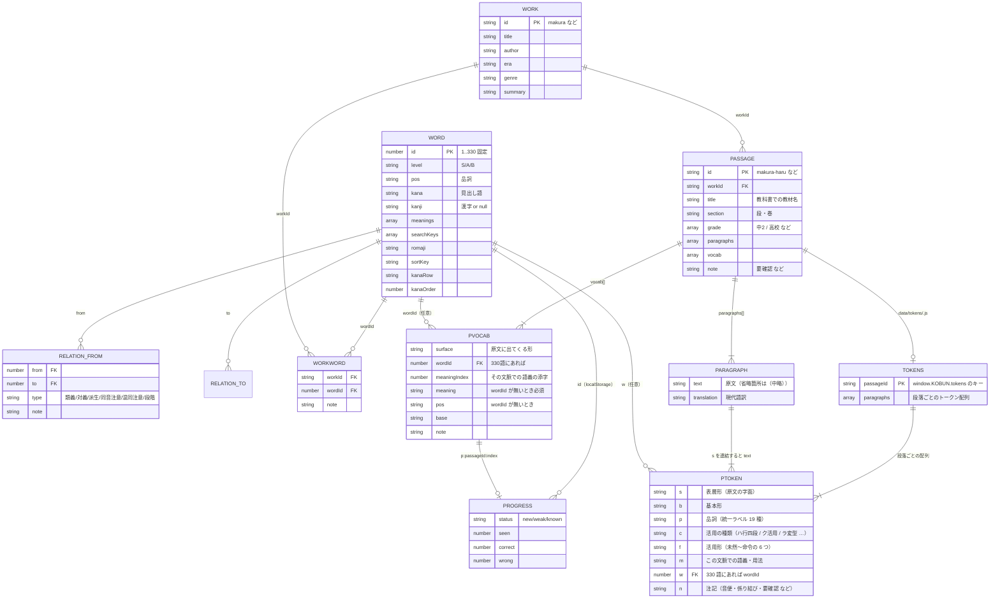
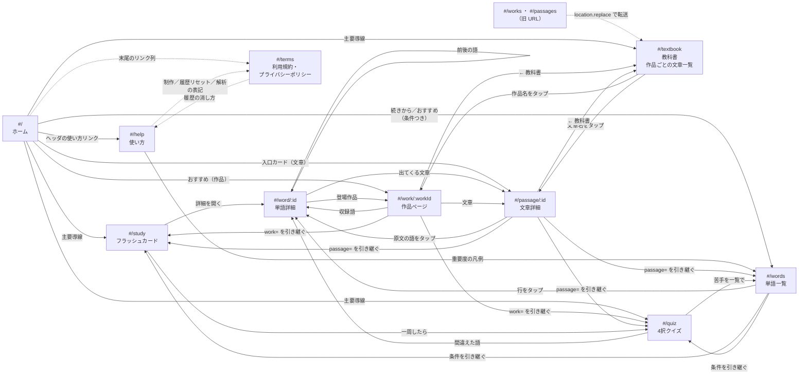

# 古文単語帳アプリ 設計書

プロトタイプ。**「あとから要素を足していける」ことを最優先**にしたデータ設計になっている。
この文書は、いま何がどう繋がっているかと、足したくなったときにどこを触るかを書いたもの。

---

## 1. 基本方針

| 決めごと | 理由 |
|---|---|
| ビルド不要の静的アプリ | `index.html` をダブルクリックすれば動く。環境構築でつまずかない |
| データは `data/*.js`（JSON ではない） | `file://` では `fetch` が CORS で弾かれる。`window.KOBUN.words = [...]` の形なら `<script>` で普通に読める |
| ES モジュールを使わない | `type="module"` も `file://` では CORS で弾かれる。素の `<script>` を順番に並べる |
| Vanilla JS / 依存ゼロ | npm も CDN も要らない。5 年後に開いても動く |
| ハッシュルーティング | `#/word/39` で直リンクできて、かつ `file://` でも動く |
| 学習履歴のキーは `id` | `kana` は重複しうる（`ながむ`〔眺む〕/〔詠む〕、`ゐる`〔居る〕/〔率る〕） |
| 教材の文章は `data/passages.js`、その品詞分解は `data/tokens/<文章id>.js` | 原文・訳と、語ごとの品詞分解では 1 編あたりの分量が桁違い。分けておけば品詞分解を 1 編ずつ足せて、複数人で同時に書いても衝突しない |
| UTF-8（BOM なし）／`.bat` を作らない | Windows の cp932 で日本語入り `.bat` が壊れる問題を避ける。起動用は `start.ps1` |

---

## 2. データモデル



**PTOKEN のキーが 1 文字なのは、全 20 編 65 段落ぶんを書くとファイルが大きくなるため。**
意味は `docs/tokens-guide.md` にまとめてあり、画面に渡す前に
`C.normalizeToken()` が `surface/base/pos/detail/meaning/wordId/note` に展開する
（ポップアップ `C.tokenPopup` と一覧表 `C.tokenTableOf` はこの展開後の形を読む）。

### ファイルと責務

| ファイル | 中身 | 素材との関係 |
|---|---|---|
| `data/site.js` | アプリ名・公開 URL・制作者情報・アクセス解析の設定 | 新規（データではなく設定。4-c / 4-d 参照） |
| `data/words.js` | 単語 330 語 | 素材 `kobun_words.json` を **無変更** で移し替え |
| `data/works.js` | 作品 6 件 | 新規（アプリ側の追加データ） |
| `data/relations.js` | 単語間リンク 57 本 | 新規 |
| `data/workWords.js` | 作品タグ 26 件 | 新規 |
| `data/passages.js` | 教材 20 編（段落 65・vocab 250 件） | 新規 |
| `data/tokens/<文章id>.js` | 教材の全文品詞分解（1 文章 = 1 ファイル） | 新規。仕様は `docs/tokens-guide.md` |

`words.js` を素材そのままに保つことで、**素材が更新されたら再生成して差し替えるだけ**で済む。
アプリ独自の情報は必ず別ファイルに置き、`id` で紐づける。

### 設計の要点

**1. 原文はトークン列で持つ**

原文を「文字列＋現代語訳」だけで持つと、単語と本文を結ぶのに文字列検索が必要になり、
活用形（`うつくしう` ≠ `うつくし`）と同音異義語（`ながむ` が 2 語）で必ず破綻する。
トークン単位で `w`（wordId）を持たせれば、リンクは id で確定する。
トークンはそのまま品詞分解の表示データにもなり、原文タップのポップアップ・
段落ごとの一覧表・単語詳細の「この語が出てくる文章」がすべて同じ 1 つのデータから出る。

**2. 関連語は片方向で書く**

`{ from: 39, to: 41, type: '対義' }` と 1 行書けば、`js/data-index.js` が
`をかし → あはれなり` と `あはれなり → をかし` の両方に展開する。
逆向きの行を書く必要がない＝データの重複がないので、直すときも 1 か所で済む。

**3. 作品の収録語は「和集合」**

作品ページの収録語 ＝ **passages の vocab の wordId** ∪ **品詞分解の `w`**
∪ **workWords の手動タグ**。
文章や品詞分解を書けば自動的に語が紐づき、まだ無い語も手で足せる。
あとから重複しても、和集合なので二重に出ない。

**3-b. 教材の品詞分解はファイルを分ける**

教材 20 編（65 段落）を全文品詞分解すると 2500 トークンを超える。
1 ファイルに詰めると数千行になって編集しづらく、複数人で同時に書くと衝突する。
そこで **1 文章 = 1 ファイル**（`data/tokens/<文章id>.js`）に分け、
`window.KOBUN.tokens[passageId]` に段落ごとの配列として載せる。
`index.html` と `sw.js` の読み込みは `tools/sync-tokens.mjs` が
ディレクトリの実際の中身から作り直すので、書き忘れも 404 も起きない。
品詞分解がまだ無い文章は、原文中のハイライトが `vocab[].surface` の
**文字列一致**（`js/components.js` の `passageLine`）に落ちるだけで、そのまま動く。

文字列一致で困るのは 2 点だけで、どちらも対処済み:

- **包含関係**（`たまへ` ⊂ `のたまへ`）… surface を **長い順**に試すので長いほうが勝つ。
- **別語の一部に当たる**（`え` が `消え` に当たる）… 1 文字の仮名 surface を
  `tools/validate.mjs` が警告する。`え得` `え張る` のように 2 文字以上の形で書く。

同じ surface が本文に何度出てきても、走査位置を進めるだけなので全部ハイライトされる。

**3-c. 文章固有語は「330 語と同じ形」に包む**

教科書の脚注に出るような語（`かいもちひ` `ずちなく`）は 330 語に無い。
これを学習カード・クイズに出すために、`js/data-index.js` が Word と同じ形の
オブジェクト（`isPassageWord: true`、level は `'P'`）に包む。
包んでしまえば **`view-study.js` / `view-quiz.js` はそのまま動く**。
違いは id が数値でなく `"p:<passageId>:<index>"` という文字列であることだけで、
そこは `store` が文字列キーを受け付けるようにしてある。

**4. 検索キーは素材の正規化ルールに乗る**

`searchKeys` は「濁点を清音化・小書き仮名を大書きに・記号を除去・ゐゑを→いえお」で
作られている（SCHEMA.md）。`js/util.js` の `normalizeKana()` がクエリに同じ変換をかけるので、
`つれづれ` でも `つれつれ` でも当たる。
ローマ字は「仮名の字面」寄り（`たまふ` → `tamafu`、`をかし` → `okashi`）なので、
`romajiVariants()` で `wokashi` → `okashi`、`hu` → `fu` の揺れも吸収している
（330 語の romaji に `wo/wi/we/hu` が出現しないことは `tools/validate.mjs` が確認する）。

---

## 3. 画面と遷移



### ルート一覧

| パス | ビュー | クエリ |
|---|---|---|
| `#/` | `view-home` | —（ハッシュ無しで開いたときもここ） |
| `#/help` | `view-help` | `?to=` 節へスクロール（about / level / search / plan / cards / passage / history / data / env / app / share / author） |
| `#/words` | `view-words` | `?q= &level= &pos= &row= &work= &passage= &status= &sort=` |
| `#/word/:id` | `view-word` | — |
| `#/textbook` | `view-passages`（教科書） | `?grade=` |
| `#/work/:workId` | `view-works` | — |
| `#/passage/:id` | `view-passages`（詳細） | — |
| `#/study` | `view-study` | 単語一覧と同じ（`sort` 以外） |
| `#/quiz` | `view-quiz` | 同上 |
| `#/terms` | `view-terms` | `?to=` 節へスクロール（terms / privacy） |

**旧 URL**（`js/router.js` の `REDIRECTS`。クエリはそのまま引き継ぐ）:

| 旧 | 新 |
|---|---|
| `#/works`（作品一覧） | `#/textbook` |
| `#/passages`（文章一覧） | `#/textbook` |

`#/work/<id>` と `#/passage/<id>` は変わっていないので、直リンクもブックマークも生きている。
転送は `location.replace` でハッシュを差し替える（履歴を消費しないので「戻る」でループしない）。
`file://` で `location.replace` が使えない場合は `location.hash` の直書きにフォールバックする。

**`#/terms`（利用規約・プライバシーポリシー）はナビにもタブにも入れない。**
毎日使う画面ではないが、いつでも辿れる必要があるので、導線は
「共通フッタの制作者行」「ホーム末尾のリンク列」「使い方の制作節・末尾」
「使い方の履歴リセットの近く」「使い方のアクセス解析の表記の近く」の 5 か所に置く。
`Router.updateNav` の map にも入れないので、どのタブも点灯しない。

ホームと使い方はナビの扱いが他と違う。
**ホームはヘッダ左のタイトル**から、**使い方はヘッダ右の小さなリンク**から開く。
スマホの下タブ（`position: fixed`）は 4 個（単語／教科書／学習／クイズ）で、この 2 つを足さない。
どちらも全幅で常に見える。

タブの現在地判定（`Router.updateNav`）では、**`#/textbook` `#/work/*` `#/passage/*` のすべてで
「教科書」タブを点灯**させる。入口が 1 本なので、深い階層にいても自分がどのタブの中かが分かる。

### フィルタ条件は URL に持つ

`#/words?q=&level=S&pos=敬語&row=あ行&work=makura&passage=makura-haru&status=weak&sort=kana`

- ブックマークできる／共有できる
- 学習・クイズへ **同じクエリのまま** 渡せる（`#/study?level=S&pos=敬語`）
- 絞り込みロジックは `js/components.js` の `applyFilters()` 1 か所だけ。3 画面で共有している

`passage=` だけ扱いが少し違う。ほかの条件が「330 語を絞る」のに対し、
`passage=` は **母集団そのものを差し替える**（330 語 → その文章の語＋文章固有語）。
この分岐は `js/components.js` の `deckSource()` 1 か所にまとめてあり、
単語一覧・学習・クイズの 3 画面はどれも `applyFilters(deckSource(query), query)` と書く。
`passage=` があるときは `work=` は無視する（意味が重なるため）。

### 各画面

| 画面 | できること |
|---|---|
| **ホーム** | アプリの説明と 3 つの主要導線（学習／教科書の文章／クイズ）。330 語の進捗（覚えた・苦手・未学習）と「続きから」（最後に学習したデッキ・最後に読んだ文章）。履歴ゼロなら「まず S ランク 114 語から」。おすすめ（苦手が溜まっていれば復習、なければ未学習の文章・作品・重要度/品詞を日替わりで）。重要度・品詞・学年・文章への入口カード（「作品から選ぶ」は教科書に統合したので置かない） |
| **使い方** | できること／重要度 S・A・B の意味／検索のコツ／学習の進め方／カードとクイズの操作／文章ページの見方／**学習履歴はこのブラウザだけに保存されること**とリセット（2 段階ボタン）／データの出どころ／動作環境。`?to=history` のように節を指定して開ける |
| **単語一覧** | かな／ローマ字／漢字／意味で検索。重要度・品詞・五十音行・作品・学習状態でフィルタ。五十音順／重要度順／品詞順でソート。各行に学習状態バッジ |
| **単語詳細** | 語義一覧、学習状態の切り替え、関連語カード（type ごとにグループ化）、**この語が出てくる文章**（教材の段落を原文のまま並べ、その語をハイライト。原文のどの語もタップで品詞分解ポップアップ）、登場作品、五十音順の前後ナビ |
| **教科書** | 教材を作品別にグループ化した唯一の入口。作品の見出し行は作品ページへのリンクで、作者・時代・ジャンルと文章数・収録語数を添える。各文章カードに段落数・語数・学習進捗（覚えた/総数）。学年でしぼれる。文章がまだ無い作品も「文章はまだありません／収録語 N 語」として出す |
| **作品ページ** | 作品の書誌と紹介。その作品の文章と収録語（「文章」／「タグ」バッジで由来がわかる）。「この作品の単語で学習／クイズ」 |
| **文章詳細** | 原文と現代語訳を段落ごとに対応表示（上下／横並びの切替、訳の表示・非表示）。**原文のどの語をタップしても品詞・活用・語義が出る**。段落ごとに「品詞分解を表で見る」。この文章の単語一覧（330 語は詳細へリンク、文章固有語はその場で語義）。「この文章の単語で学習／クイズ」 |
| **学習** | フィルタしたデッキをカードで。表＝見出し語 → めくると語義＋用例（その語が出てくる段落）。「覚えた／まだ」を記録。Space でめくる、←→ で回答、**裏面は右／左スワイプでも回答**。**めくる前は回答できない**（ボタンは disabled、キーもスワイプも効かず「先にめくって答えを確認」と出る）。一周後に「まだの語だけで復習」 |
| **クイズ** | 4択。誤答は **同じ品詞の別語** から取る（SCHEMA.md の推奨）。語→意味／意味→語 の 2 形式。1〜4 の数字キーで回答。結果を localStorage に記録し、間違えた語だけ再出題できる |
| **利用規約・プライバシーポリシー** | 前半＝利用規約（適用／サービス内容／知的財産／禁止事項／免責／未成年／変更／準拠法・管轄／問い合わせ）、後半＝プライバシーポリシー（学習履歴は localStorage のみ／アクセス解析／Cookie／外部リンク／PWA のキャッシュ／改定／問い合わせ）。アプリ名・URL・制作者名・X・**GA4 の有無**は `data/site.js` から動的に埋める。`?to=privacy` で後半へ |

---

## 4. コードの構成

```
index.html          <script> を順番に並べるだけ。順序に意味がある
css/style.css       CSS 変数で配色を一括管理。ダークモードは prefers-color-scheme
data/site.js        アプリ名・公開 URL・制作者情報（共有と OGP はここを見る）
data/*.js           データ（人が編集する）
js/util.js          DOM の小道具・文字列正規化・検索スコア
js/store.js         localStorage（学習履歴・設定・クイズ履歴）
js/analytics.js     アクセス解析（GA4 / Cloudflare。設定が空なら完全に no-op。4-d 参照）
js/data-index.js    data/*.js から索引をつくる ★ここが接着剤
js/components.js    画面をまたぐ部品（単語行・関連語カード・原文のトークン描画・品詞分解ポップアップ／一覧表・フィルタ・共有ボタン・制作者行）
js/router.js        ハッシュルーター
js/view-home.js     ホーム（既定ルート #/。index と store しか読まない）
js/view-help.js     使い方（説明文はこのファイルの中。数字は index から出す）
js/view-terms.js    利用規約・プライバシーポリシー（#/terms。文面はこのファイル、
                    名称・URL・制作者・GA4 の有無は data/site.js から埋める）
js/view-words.js    単語一覧
js/view-word.js     単語詳細
js/view-works.js    作品ページ（#/work/:workId）
js/view-passages.js 教科書（#/textbook）＋文章詳細（#/passage/:id）
js/view-study.js    フラッシュカード
js/view-quiz.js     クイズ
js/app.js           起動＋Service Worker の登録・更新バー
manifest.webmanifest    ホーム画面に追加（PWA）の設定
sw.js               Service Worker（network-first。オフラインと「アプリとして追加」用）
assets/             アイコン（icon*.svg / *.png・favicon.svg）と OGP 画像（ogp.svg / ogp.png）
tools/validate.mjs      データ整合性チェック（Node）
tools/bump-version.mjs  index.html の ?v=... と sw.js の CACHE_VERSION を更新（公開前に実行）
```

依存の向きは一方向：`data → data-index → components → view-* → app`。
ビューはデータ形式を直接知らず、`KOBUN.index` のメソッド越しに引く。
そのため **データの持ち方を変えても `data-index.js` だけ直せば済む**。

---

## 4-b. UI 方針とデザイントークン

### 方針

| 決めごと | 理由 |
|---|---|
| **明朝は「古語」だけ** | 見出し語・原文・作品名・画面タイトルは `--font-serif`。UI（ボタン・バッジ・訳・説明文）はゴシック。字面で「これは古文だ／これは操作だ」が分かる |
| **重要度 S/A/B の色は全画面で同じ** | 一覧の左端の色帯・バッジ・関連語カードで `--level-S/A/B` を共有する。色の意味を画面ごとに変えない |
| **重要度は記号だけで出さない** | `S` の 1 文字では初見で意味が分からない。バッジは必ず **「S 最重要」** の形（`C.levelBadge`）。色は S＝赤・A＝橙・B＝青緑で「重要なほど強い色」に並べ、明度も変えて色覚に依らず区別できるようにする。文章固有語は「P 文章の語」 |
| **重要度の意味は 3 か所に書く** | 単語一覧の上・ホームの入口カード・使い方ページに同じ凡例（`C.levelLegend`）を出す。説明文と語数は `KOBUN.index.levels` の 1 か所から取るので、言い方がぶれない |
| **ホームは「次の一手」だけ** | トップは入口。数字を並べるより「続きから」「苦手 N 語を復習」のようにボタン 1 つで始められる形にする。履歴ゼロのときは進捗を出さず「まず S ランクから」に置き換える |
| **語義は薄くしない** | 一覧で本当に読みたいのは語義なので `--fg` で置く。薄い色（`--fg-muted`）は補助情報だけ、`--fg-faint` は区切り記号など装飾だけ |
| **既定値はバッジにしない** | 一覧の「未学習」バッジは CSS で隠す（`.word-list .badge.status-new`）。330 行すべてに付くバッジは情報量ゼロ。要素は残すので `kobun:progress` の書き換えはそのまま動く |
| **色だけで意味を伝えない** | クイズの正誤は色＋`○`／`×`、文章の語は色＋線種（実線＝330 語／点線＝文章固有語）。文章詳細には凡例を必ず出す |
| **スマホではメニューを下タブに** | 640px 以下で `.site-nav` を `position: fixed` の下タブへ。親指の届く位置に置き、上部を本文に使う。高さは `--tab-h`（64px）＋ `env(safe-area-inset-bottom)`、タップ領域は高さ全体。各リンクにインライン SVG（線画・`currentColor`）のアイコンを添え、デスクトップ幅（`.nav-icon`）では非表示にしてラベルのみのピル表示に戻す |
| **記録は答えを見てから** | フラッシュカードの表面では「覚えた／まだ」を選べない（ボタンは `disabled`、← → とスワイプも無効）。答えを見ずに付いた記録で進捗が実態とずれるほうが害が大きい。押されたら理由（「先にめくって答えを確認」）をボタンの下に 1.6 秒出す |
| **スワイプは裏面だけ・いつでも戻せる** | 右＝覚えた（緑）／左＝まだ（赤）。80px 動かすまでは確定せず、手を止めて戻せば記録は付かない。指の動きにカードが追従して傾き、ラベルが移動量ぶん濃くなるので「いまどちらに倒れているか」が常に見える。`touch-action: pan-y` と「最初の数 px で縦横を判定」で、縦スクロールは奪わない |
| **フィルタは畳める** | `C.filterBar` は `<details>` を返す。閉じていても summary に「いま効いている条件」がチップで出る。学習・クイズは既定で畳む（カードを先に見せる） |
| **コントラストは AA（4.5:1）** | `--fg-muted` は対 `--bg` 5.6:1、重要度バッジの白抜きは 5.8〜7.0:1。ダークも同様に確認済み |
| **動きは控えめ・止められる** | めくり／正誤のアニメーションは 0.2〜0.3 秒。`prefers-reduced-motion: reduce` で全部止まる |
| **外部依存ゼロは維持** | Web フォント・CDN・アイコンフォントは使わない（`file://` とオフラインで動くこと） |

### デザイントークン（`css/style.css` の `:root`）

個々のルールでは生の値を書かず、必ず `var(--…)` を使う。
色は「`:root` で明るい側を定義 → `@media (prefers-color-scheme: dark)` で暗い側だけ上書き」の一方向。

| 種類 | トークン |
|---|---|
| **面** | `--bg`（画面の地）`--bg-card`（カード）`--bg-sub`（バッジ・表頭）`--bg-inset`（カードの中の面：訳・用例） |
| **文字** | `--fg`（本文）`--fg-muted`（補助・AA 合格）`--fg-faint`（装飾のみ） |
| **罫** | `--line` / `--line-strong` |
| **強調** | `--accent` `--accent-fg` `--accent-bg` `--accent-dim`（原文の下線）`--hl`（マーカー）`--focus` |
| **状態** | `--ok`（覚えた・正解）`--danger`（苦手・不正解）`--warn`（要確認）`--on-solid`（塗りの上の文字色） |
| **重要度** | `--level-S` `--level-A` `--level-B` `--level-P`（文章固有語）`--on-level` |
| **余白** | `--sp-1`(.25rem) `--sp-2`(.5) `--sp-3`(.75) `--sp-4`(1) `--sp-5`(1.5) `--sp-6`(2) |
| **角丸** | `--r-sm`(6px) `--r-md`(10) `--r-lg`(14) `--r-pill`(999)／旧名 `--radius` |
| **影** | `--shadow-sm` / `--shadow-md` / `--shadow-lg`（旧名 `--shadow`） |
| **文字サイズ** | `--fs-xs`(.75rem) `--fs-sm`(.84) `--fs-md`(.92) `--fs-base`(1) `--fs-lg`(1.12) `--fs-xl`(1.35) `--fs-2xl`(1.7) `--fs-3xl`(2.2) |
| **行間** | `--lh-tight`(1.4 見出し) `--lh-body`(1.8 UI 本文) `--lh-read`(1.9 訳) `--lh-classic`(2.15 古文原文) |
| **書体** | `--font-ja`（ゴシック）`--font-serif`（明朝） |
| **その他** | `--maxw`(980px) `--tap`(44px 最小タップ領域) `--tab-h`(64px スマホ下タブバーの高さ。safe-area は別枠) `--dur` `--ease` |

配色を変えたいときは `:root` と dark ブロックの色トークンだけを書き換える。
`--radius` `--shadow` は旧名として残してあるので、古いルールが混ざっていても壊れない。

---

## 4-c. 共有・制作者情報・ホーム画面に追加（PWA）

### 設定は `data/site.js` の 1 か所に集める

アプリ名・公開 URL・説明文・ハッシュタグ・制作者（名前と X / YouTube / BOOTH の URL）は
`data/site.js` が `window.KOBUN.site` として持つ。画面側はここしか読まない。
`index.html` では **`data/*.js` の先頭**で読み込む（`js/*.js` より前ならどこでもよい）。

| キー | 使いどころ |
|---|---|
| `name` `description` | 共有文面・OGP・`<meta name="description">` と言い方を揃える |
| `url` | 共有 URL の土台。**末尾 `/` の絶対 URL**にする |
| `hashtags` | X の intent に渡す（`#` は付けない） |
| `author.name` | 「制作：雨峰あまね」の名前 |
| `author.x` / `.youtube` / `.booth` | 外部リンク。**空文字や `PLACEHOLDER` を含む値ならリンクを出さない** |

URL が使えるかどうかは `js/components.js` の `isUsableUrl`
（`https?://` で始まり `PLACEHOLDER` を含まない）が毎回みている。
差し替え前のプレースホルダのまま公開しても、リンクが消えるだけで画面は壊れない。

### 共有コンポーネント `C.shareButtons(opts)`

`js/components.js`。`{ title, text, url, hashtags, label }` を渡すと共有ボタンの一列を返す。

- **URL は必ず絶対 URL**にする。`C.absUrl('#/word/39')` は、`file://` とローカルサーバー
  （localhost / 127.0.0.1 / `.local`）のときだけ `KOBUN.site.url` を土台にし、
  公開環境ではいま開いている URL を土台にする。手元の URL をそのまま配ってしまう事故を防ぐため。
- **ボタンの出し分け**：`navigator.share` があり、かつ `pointer: coarse`（指で触る画面）のときだけ
  「共有」1 つ＋「リンクをコピー」。それ以外（PC）は X・LINE・リンクをコピーの 3 つ。
  PC の Chrome にも `navigator.share` はあるが、共有シートを開くより
  直接 X が開くほうが早いので、画面の種類で分けている。
- `navigator.share` は**クリックのハンドラの中で同期的に**呼ぶ（そうしないとブラウザに拒否される）。
  ユーザーが閉じただけの `AbortError` は無視し、それ以外の失敗のときだけ X・LINE を出す。
- **コピー**は `navigator.clipboard.writeText` →失敗したら一時 `<textarea>` ＋ `execCommand('copy')`。
  結果は 2 秒だけ「コピーしました」と出す（`role="status"` なので読み上げにも乗る）。
- アイコンは外部フォントを使わずインライン SVG の線画（ヘッダのナビと同じ流儀：
  24×24・`currentColor`・`stroke-width 1.8`）。X は交差する 2 本、LINE は吹き出しに単純化してある
  （商標ロゴの厳密な再現はしない）。

置き場所は 6 か所。文面は「何を共有しているか」が本文だけで分かる形にする。

| 画面 | 文面 | リンク先 |
|---|---|---|
| クイズ結果 | 「古文単語クイズ 10 問中 8 問正解（正答率 80%）！【重要度 S 最重要】」 | 結果ではなく**同じ条件で始められる** `#/quiz?level=S&count=10` |
| 単語 | 「『をかし』＝趣がある・風情がある｜古文単語帳」 | `#/word/:id` |
| 文章 | 「枕草子『春はあけぼの』を原文と現代語訳で読む｜古文単語帳」 | `#/passage/:id` |
| 作品 | 「『徒然草』の単語と文章｜古文単語帳」 | `#/work/:id` |
| 学習の完走画面 | 「古文単語帳のフラッシュカードで【重要度 S 最重要】114 語を 1 周しました！」 | 同じ条件の `#/study?…` |
| ホーム・使い方 | 「古文単語帳｜入試向けの…」（`C.appShareButtons`） | `#/` |

### 制作者情報

`C.authorLine()` は「制作：雨峰あまね」＋アイコンリンク（既定は X・YouTube）の 1 行で、
**ホームの末尾**と**共通フッタ**に同じものを出す。
`C.authorBlock()` は使い方ページの「制作」節用（X・YouTube・BOOTH をラベル付きで）。
共通フッタは `index.html` に直書きせず、`js/app.js` が `#footer-stat` の下に足す
（名前や URL を変えるときに触る場所を `data/site.js` だけにするため）。

### ホーム画面に追加（PWA）

| 部品 | 役割 |
|---|---|
| `manifest.webmanifest` | 名前・アイコン・`display: standalone`。パスはすべて相対（`./`）なので、GitHub Pages のサブパス `/kobun-tango/` でも壊れない |
| `sw.js` | Service Worker。**network-first**（ネットを先に見て、失敗したらキャッシュ） |
| `assets/icon-192.png` `icon-512.png` `icon-maskable-512.png` `apple-touch-icon.png` | 元データは `assets/icon.svg`（maskable だけ余白を広く取った `assets/icon-maskable.svg`） |
| `C.installBlock()` | `beforeinstallprompt` を捕まえて出す「ホーム画面に追加」ボタン。イベントが来ない環境（iOS Safari）では枠ごと出ない。すでにスタンドアロン起動中なら隠す |
| `js/app.js` | `http(s)` のときだけ `./sw.js` を登録する（`file://` では登録できない仕様）。登録失敗は `console.warn` だけ |

**cache-first にしない**のは、データを直したのに古い本文が出るのがいちばん困るため。
キャッシュ名は `kobun-<版>` で、版（`sw.js` の `CACHE_VERSION`）は
`tools/bump-version.mjs` が `index.html` の `?v=` と一緒に上げる。
古いキャッシュは activate でまとめて消える。

新しい Service Worker は自動で入れ替えない。待機させたまま画面下に
「新しいバージョンがあります — 再読み込み」の小さなバーを出し、押されたら
`SKIP_WAITING` →交代→再読み込みする（読んでいる途中でページが差し替わらないように）。

### OGP と favicon

`index.html` の `<head>` に `og:*` と `twitter:card=summary_large_image` を直書きしてある
（値は `data/site.js` と同じにする。`og:url` `og:image` は**絶対 URL** でないとカードが出ない）。
画像 `assets/ogp.png`（1200×630）は `assets/ogp.svg` を
Chrome の headless スクリーンショットで PNG にしたもの。作り直すときも同じ手順でよい。

```powershell
& "C:\Program Files\Google\Chrome\Application\chrome.exe" --headless=new --disable-gpu `
  --window-size=1200,630 --screenshot=assets\ogp.png assets\ogp.svg
```

SVG の文字はシステムのフォントで描かれるので、書体指定は必ずフォールバックを並べる
（Windows は Yu Mincho、Mac は Hiragino Mincho、無ければ `serif`）。

---

## 4-d. アナリティクス（アクセス解析）

### 設計

| 決めごと | 理由 |
|---|---|
| **設定は `data/site.js` の `analytics` だけ** | 共有・制作者情報と同じ流儀。ID を差し替える場所を 1 か所にする |
| **空文字なら何も読み込まない** | 未設定のまま公開しても外部通信ゼロ。`file://` で開く使い方も壊さない |
| **`http(s)` のときだけ計測する** | `file://` では送り先も参照元も意味がない |
| **localhost はデバッグモード** | 手元の動作確認で本番の数字を汚さない。`console.debug` に送信内容を出すだけで、外へは 1 バイトも出ない |
| **ページビューは自前で送る** | ハッシュルーティングなので `gtag` の自動計測では最初の 1 回しか数えられない。`gtag('config', …, { send_page_view: false })` にして、router の描画完了で送る |
| **分析コードは `js/analytics.js` に閉じる** | 各 view は `KOBUN.analytics.event(...)` を 1 行呼ぶだけ。パスの組み立て・検索語の除外・パラメータの掃除は全部 analytics 側の仕事 |
| **無効時は no-op** | 呼び出し側に `if (計測してる?)` を書かない。`KOBUN.analytics` は常に存在する |
| **読み込み順は store の後・router の前** | `data/site.js` を読んだ後であること。router がページビューを呼ぶので router より前 |

```
data/site.js（設定）
   └─ js/analytics.js  ── gtag.js を動的挿入（live のときだけ）
        ├─ js/router.js     描画完了 → pageview(path, title)
        └─ js/view-*.js     節目だけ event(name, params)
```

### イベント一覧

| イベント | パラメータ | 送る場所 |
|---|---|---|
| `page_view` | `page_path` `page_title` `page_location` | `js/router.js`（`Router.render` の最後） |
| `quiz_complete` | `deck`（level/pos/work/passage/all）`deck_id` `count` `correct` `score_pct` | `js/view-quiz.js` の結果画面 |
| `study_complete` | `deck` `deck_id` `count` `known` `weak` | `js/view-study.js` の完走画面（1 周につき 1 回） |
| `share` | `method`（native/x/line/copy）`content_type`（quiz/study/word/passage/work/app）`item_id` | `js/components.js` の `C.shareButtons`（`contentType` / `itemId` は呼び出し側が渡す） |
| `search` | `hit_count` `has_query` | `js/view-words.js`（入力が止まってから 1 回） |
| `word_view` | `word_id` `level` | `js/view-word.js` |
| `passage_view` | `passage_id` `work_id` | `js/view-passages.js`（文章詳細） |
| `token_tap` | `passage_id` | `js/components.js` の `passageLine` / `passageTokenLine` |
| `install_prompt` | `outcome`（accepted/dismissed） | `js/components.js` の `C.installBlock` |
| `app_installed` | — | `appinstalled` イベント |
| `history_reset` | — | `js/view-help.js` の 2 段階リセット |

**送らないと決めたもの**

- `study_mark`（1 語ごとの「覚えた／まだ」）… 1 周で数十件になり、意味のある差も出ない。
  完走イベントの `known` / `weak` で足りる。
- `search_term`（検索語）… 何を調べたかは個人の関心そのもの。件数だけ送る。
- 学習履歴の中身（どの語を覚えたか）。

### 無効時の挙動

`KOBUN.site.analytics` の 2 つがどちらも空文字のとき:

- 外部スクリプトを挿入しない。`window.gtag` も `dataLayer` も作らない（**外部通信ゼロ**）。
- `KOBUN.analytics.pageview()` / `.event()` は呼んでも何も起きない（no-op）。
- 使い方ページの「学習履歴について」に、計測の段落を**出さない**
  （同じ節の「サーバーには一切送信しません」の文言も、設定があるときだけ
  「学習履歴の中身は送信しません」に切り替わる）。

`file://` で開いたときは、設定があっても同じく何もしない。

### プライバシー方針

1. **個人を特定しない。** ログイン・ユーザー ID は無い。GA4 は `anonymize_ip: true`。
2. **本人の中身は送らない。** 学習履歴・検索語は端末の外に出ない（`js/analytics.js` の
   `BANNED_PARAM_KEYS` が `q` などのキーを機械的に落とす）。
3. **URL からも検索語を落とす。** ページビューのパスに残すのは
   `SAFE_QUERY_KEYS`（level / pos / row / work / passage / status / sort / grade / mode / count / to）だけ。
   `page_location` も `location.href` をそのまま使わず、この安全なパスから組み立てる。
4. **書いてあることと実装を一致させる。** 表記の出し分けは `KOBUN.site.analytics` を見る
   （計測していないのに「送ることがあります」と書かない）。
5. **詳細は 1 か所（`#/terms`）に書く。** 使い方ページの「学習履歴について」は 2〜3 行の
   要約＋「詳しくはプライバシーポリシー」のリンクに留め、
   「送る情報／送らない情報」の箇条書きは `js/view-terms.js` にだけ置く。
   **上のイベント一覧を増やしたら `js/view-terms.js` の箇条書きも直すこと**
   （このファイルの表と本文が 1 対 1 で対応している）。
   `analytics.ga4` が空のときは、その節が
   「現在アクセス解析は使用していません」に丸ごと切り替わる。

### Service Worker との関係

`sw.js` の `fetch` ハンドラは **同一オリジン以外を即 `return`** する
（＝ Service Worker が手を出さず、ブラウザがそのまま出す）。
googletagmanager.com / google-analytics.com / cloudflareinsights.com はクロスオリジンなので、
**もともとキャッシュ対象外で素通し**になっている。
`js/analytics.js` 自体は同一オリジンなので `PRECACHE` に足してある。

---

## 5. 拡張ポイント（手順）

### 5.1 関連語を足すには

1. `data/words.js` を検索して、両方の語の **id** を確かめる。
   （`kana` は重複しうるので必ず id。`ながむ` は 53 と 54 の 2 語ある）
2. `data/relations.js` の配列に 1 行足す。

   ```js
   { from: 51, to: 64, type: '派生', note: 'ともに「思ふ」系。おぼゆ＝自発、おぼす＝尊敬。' },
   ```
3. **逆向きは書かない**。`data-index.js` が自動で双方向に展開する。
4. `node tools/validate.mjs` を実行してエラー 0 を確認。
5. コードの変更は不要。両方の語の詳細ページに出る。

`type` は自由に増やしてよい。表示の説明文を出したいときは
`js/view-word.js` の `TYPE_HINT` に 1 行足す。
非対称な関係（`派生` は「元 → 派生語」の向きがある）は
`js/data-index.js` の `INVERSE_TYPE` に逆向きのラベルを書く。

### 5.2 `data/examples.js`（旧「例文」）について — 退避済み

かつては「例文（`data/examples.js`。1 文単位・全トークン品詞分解）」と
「文章（`data/passages.js`。教材単位・訳つき）」の 2 系統があった。
そのため文章ページに **「原文と現代語訳」と「品詞分解つき例文」の枠が 2 つ**並び、
同じ本文が二度出て分かりにくい、という指摘を受けた。

そこで教材の原文そのものに品詞分解を付ける `data/tokens/*.js`（5.2c）を作り、

- 文章ページ … 原文をトークンから描き、**どの語もタップで品詞分解**。例文枠は廃止
- 単語詳細 … 「例文」枠を **「この語が出てくる文章」**（段落単位）に統合
- 作品ページ … 例文枠を廃止（文章カードから読む）
- 学習・クイズ … 用例は `C.usageFor()` が「その語が出てくる段落」から取る

とし、`examples.js` は読み込みを外して **`docs/legacy/examples.js`** に退避した。
`passages.js` の `exampleIds`、`js/components.js` の `C.sentence` / `C.exampleCard`、
`js/data-index.js` の `examplesByWord` / `examplesByWork` / `exampleById`、
`tools/validate.mjs` の `[examples]` ブロックも同時に削除している。

**失われたもの**: `ise-1`（伊勢物語 第一段「初冠」）は対応する教材が `passages.js` に
無かったため、UI から消えた。必要になったら `passages.js` に教材として足し、
`data/tokens/ise-uikoburi.js` に品詞分解を作る（退避したファイルにトークンが残っている）。

**新しい本文は例文ではなく、教材（5.2b）＋品詞分解（5.2c）として足すこと。**

### 5.2b 文章（教科書の教材）を足すには

1. `data/works.js` にその作品があるか確認（無ければ 5.3 を先に）。
2. `data/passages.js` の配列に 1 件足す。`id` は `作品id-短い名`（URL `#/passage/makura-haru`
   になるので **後から変えない**）。

   ```js
   {
     id: 'makura-haru', workId: 'makura', title: '春はあけぼの',
     section: '第一段', grade: ['中2', '高1'],
     paragraphs: [
       { text: '春はあけぼの。…', translation: '春は夜明け方（がよい）。…' }
     ],
     vocab: [
       { wordId: 39, surface: 'をかし', meaningIndex: 0 },        // 330 語にある語
       { surface: 'あけぼの', meaning: '夜明け方', pos: '名詞' }   // 文章固有語
     ]
     // note は任意。自信のない箇所があれば 'note: "要確認: …"' のように書く
   }
   ```
3. **原文の正確さを最優先**する。長い教材は有名な部分を抜き、
   省いた箇所は本文中に `（中略）` と書く。
   自信のない箇所は `note` に「要確認: …」と書く（画面上で橙色になる）。
4. `translation` は自分の言葉で書く（教科書・市販訳の転載はしない）。
5. `vocab` は次の 2 種類を混ぜて書く。**同じ `wordId` は 1 文章に 1 回だけ**。
   - **330 語にある語** … `wordId` と `meaningIndex`（その文脈での語義の添字）。
     活用形も見て拾う（`うつくしう` → `うつくし`、`あやしがり` → `あやし`）。
   - **文章固有語**（教科書で脚注になる語）… `meaning` と `pos` を書く。3〜10 語を目安に。
6. `surface` は **本文にそのまま出てくる文字列**にする。
   1 文字の仮名（`え`）は別語の一部に当たるので、`え得` のように 2 文字以上にする。
7. `node tools/validate.mjs` でエラー 0 を確認。
8. コードの変更は不要。教科書（`#/textbook`）・作品ページ・単語一覧の「文章」フィルタに自動で出る。
9. 続けて **5.2c** で品詞分解を作る（`vocab` の `surface` は
   品詞分解のトークン境界に沿う形にすること。検証器が警告する）。

### 5.2c 品詞分解を足すには

文章に品詞分解を付けると、**文章ページで原文のどの語をタップしても品詞・活用・語義が出る**。
段落ごとの「品詞分解を表で見る」も開き、単語詳細の「この語が出てくる文章」に
その段落が原文つきで並ぶ。付けていない文章は従来どおり（重要語だけタップ可）動く。

1. **[`docs/tokens-guide.md`](docs/tokens-guide.md)** を読む。
   キーの意味、品詞の統一ラベル 19 種、活用の種類・活用形の書き方、
   「なり」「ぬ」「に」「なむ」など定番論点の扱い、330 語との対応、担当割りまで
   すべてそこに決めてある。
2. `data/tokens/<文章id>.js` を作る（`<文章id>` は `passages.js` の `id`。1 文章 1 ファイル）。

   ```js
   window.KOBUN = window.KOBUN || {};
   window.KOBUN.tokens = window.KOBUN.tokens || {};
   window.KOBUN.tokens['makura-haru'] = [
     [ // 段落 1
       { s: '春', b: '春', p: '名詞', m: '春' },
       { s: 'は', b: 'は', p: '係助詞', m: '（主題）〜は' },
       { s: '。', p: '記号' }
     ]
   ];
   ```
3. **段落数は `paragraphs.length` と同じ**、**段落内の `s` を連結すると
   `paragraphs[i].text` と一字一句一致**させる。ここが検証の要。
4. `node tools/validate-tokens.mjs` でエラー 0 にする
   （`node tools/validate.mjs` からも最後に呼ばれる）。
5. `node tools/sync-tokens.mjs` を実行する。`index.html` の `<script>` と
   `sw.js` の `PRECACHE` が `data/tokens/` の実際の中身から作り直される。
6. コードの変更は不要。`js/data-index.js` が
   `tokensOf(passageId)` / `paragraphsOfWord(wordId)` を組み立て、
   `C.passageTokenLine` が原文を描く。

**なぜ 1 文章 1 ファイルか。** 全 20 編ぶんは 1 ファイルに収めると数千行になり、
複数人（複数エージェント）で同時に書くと衝突する。
ファイルを分ければ担当ごとに独立して書け、読み込み設定も `sync-tokens.mjs` が面倒を見る。

### 5.3 新しい作品を足すには

1. `data/works.js` に 1 件足す。`id` は英小文字とハイフンだけの短い語
   （URL `#/work/genji` とデータの外部キーになるので **後から変えない**）。

   ```js
   { id: 'genji', title: '源氏物語', author: '紫式部', era: '平安時代中期',
     genre: '作り物語', summary: '…' },
   ```
2. `data/passages.js` にその作品の教材を足し（5.2b）、品詞分解を作る（5.2c）。
3. 本文に出てこないが重要な語を `data/workWords.js` に足す。
4. `node tools/validate.mjs`。
5. コードの変更は不要。教科書（`#/textbook`）・作品ページ・単語一覧の「作品」フィルタに自動で出る。
   文章（passages）がまだ無い作品も、教科書に「文章はまだありません／収録語 N 語」として出る。

### 5.4 新しいフィールドを足すには

**単語に足す場合**（例：アクセント、語源、頻出度スコア）

- 素材との差分が分からなくなるので、`data/words.js` を直接いじらず
  **別ファイル `data/wordExtra.js`** を作って `wordId` で紐づけるのがおすすめ。

  ```js
  window.KOBUN.wordExtra = [
    { wordId: 39, etymology: '「招（を）く」と同源とする説…', accent: 'をかし＼' }
  ];
  ```
- `index.html` に `<script src="data/wordExtra.js"></script>` を追加（`js/*.js` より前）。
- `js/data-index.js` に索引を 1 つ足す（`extraByWord` の Map）。
- `js/view-word.js` に表示ブロックを足す。
- `tools/validate.mjs` に `wordId` 実在チェックを足す。

**既存オブジェクトにキーを足す場合**（例：`work.period`、`token.accent`）

- そのまま足してよい。画面側は `undefined` に耐えるように書いてある
  （`el()` は `null` の子要素を無視し、`?` で分岐している）。
- 表示したいところで 1 行足す。

**新しい「関係」の種類そのものを足す場合**（例：単語 ⇔ 文法項目）

- `data/grammar.js`（助動詞・敬語の体系など）＋ `data/wordGrammar.js`（紐づけ）を作る。
- `relations.js` / `workWords.js` と同じパターンなので、`data-index.js` の
  `wordsByWork` を作っている箇所をそのまま真似られる。

### 5.5 学習履歴の形を変えるには

保存キーは 4 つ。`kobun.v1.progress`（学習状態）／`kobun.v1.prefs`（画面設定）／
`kobun.v1.quizlog`（クイズ履歴 50 件）／`kobun.v1.recent`（ホームの「続きから」。
最後に学習したデッキの条件と、最後に開いた文章）。
`recent` は `view-study.js` と `view-passages.js` が画面を開いたときに書き、ホームだけが読む。
使い方ページの「履歴をリセット」（`store.resetAll()`）は prefs 以外の 3 つを消す。

`js/store.js` の `PREFIX = 'kobun.v1.'` を `v2` に上げ、
起動時に v1 を読んで v2 に変換する移行処理を書く。
キーが `id` である限り、単語データが更新されても履歴は生き残る。

**学習履歴のキーは 2 種類ある**（どちらも文字列で保存する）:

| キー | 何の進捗か | 例 |
|---|---|---|
| `"<数値>"` | `data/words.js` の 330 語 | `"39"`（をかし） |
| `"p:<passageId>:<vocab の添字>"` | `data/passages.js` の文章固有語 | `"p:ujishui-chigo:15"`（かいもちひ） |

330 語の進捗は単語一覧・単語詳細・文章詳細で共有される
（同じ語を別の文章で覚え直しても履歴は 1 つ）。
文章固有語は id を持たないので、作品・文章をまたいで衝突しない `p:` 接頭辞つきのキーにしてある。

そのため **`vocab` の途中に語を挿入すると、その後ろの固有語の履歴がずれる**。
語を足すときは配列の末尾に足すこと（330 語の `id` を振り直さないのと同じ理由）。

`store.summary()` は「330 語の進捗」を返すので、数値キーだけを数える。
文章・作品など任意のデッキの進捗は `store.summaryOf(ids)` を使う。

---

## 6. 今後の候補

| 候補 | どこに足すか | メモ |
|---|---|---|
| **SRS（間隔反復）** | `store.js` の progress に `ease` / `interval` / `dueAt` を追加。`view-study.js` のデッキ生成を「今日が期限の語」に | SM-2 の簡易版で十分。既存の `seen/correct/wrong` がそのまま材料になる |
| **音声読み上げ** | `SpeechSynthesisUtterance` で段落の読みを読む | `romaji` は字面なので読み上げには使えない（SCHEMA.md の注意）。`passages.js` の paragraph に `reading` を足すのが素直 |
| **音読・朗読** | `passages.js` の paragraph に `reading` を足す | 読み上げ拡張の材料になる。トークンの `s` と対応づければ 1 語ずつ読ませることもできる |
| **CSV インポート／エクスポート** | `tools/` に `csv2js.mjs` を追加 | 品詞分解・関連語を表計算で編集したい人向け。素材の CSV と同じく UTF-8 BOM 付きで出す |
| **活用練習** | 品詞分解の `c`（活用の種類）と `f`（活用形）をそのまま問題に | 「この『たる』の活用形は？」。20 編・2500 トークンぶんのデータはもう揃っている |
| **助動詞・敬語の体系ページ** | `data/grammar.js` を新設 | 敬語 27 語は本動詞／補助動詞、尊敬／謙譲／丁寧で整理したい |
| **書き取りモード** | `view-quiz.js` に mode を追加 | 意味 → 仮名を入力。`searchKeys` の正規化を答え合わせに流用できる |
| **タグ（自由タグ）** | `data/tags.js` ＋ `data/wordTags.js` | `workWords.js` と同じ形 |
| **PWA 化 / オフライン** | `manifest.json` ＋ Service Worker | ただし Service Worker は `file://` では動かない。`start.ps1` 経由 or ホスティング前提になる |
| **学習履歴のバックアップ UI** | `store.exportJSON()` はもうある。ダウンロードボタンを設置するだけ | 端末を変えても履歴を持ち運べる |

---

## 7. データの品質について

- `data/words.js` の内容は素材そのままで、素材の SCHEMA.md に
  「公開アプリに載せる前に、手元の辞書で最終確認することを勧める」とある。
- `works.js` / `relations.js` / `workWords.js` / `passages.js` / `tokens/*.js` は
  **このプロトタイプ用に書き起こしたサンプル**で、各ファイル冒頭に「サンプル・要校閲」と明記した。
- 解釈が分かれる箇所は `note` に「要確認」と書いてある。
  画面上では色（`--warn`）と破線の下線で目立つようにしてある。
- 原文は流布本・一般的な教科書本文に拠ったが、底本によって異同がある。
- `passages.js` の現代語訳は、このアプリのために書き起こしたもの。
  教科書や市販の訳を転載してはいけない（著作権は原文とは別に生きている）。
